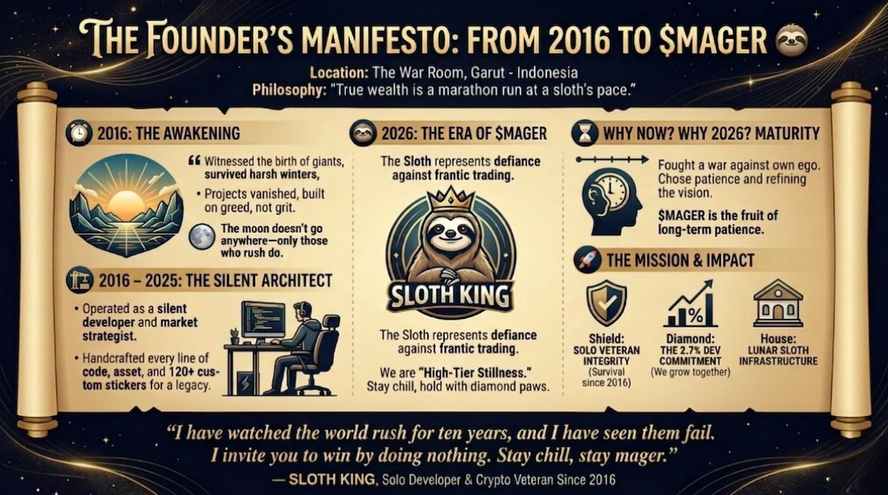

***📜 THE FOUNDER’S MANIFESTO: FROM 2016 TO $MAGER 🦥***

**Location:** The War Room, Garut - Indonesia  
**Philosophy:** *"True wealth is a marathon run at a sloth's pace."*

---

### 🕰️ 2016: THE AWAKENING

My journey didn't start yesterday with a pump-and-dump scheme. I’ve been in the trenches since **2016**. I witnessed the birth of giants, survived the harshest crypto winters, and watched thousands of projects vanish into the void because they were built on greed, not grit.

> *The moon doesn't go anywhere—only those who rush do.*

---

### 🏗️ 2016 - 2025: THE SILENT ARCHITECT

For nearly a decade, I operated as a silent developer and market strategist. While others were chasing temporary hype, I was perfecting my craft from my private workstation. I chose the path of the **Solo Developer** because I believe in absolute accountability. 

Every line of code, every visual asset, and every pixel of our **120+ custom stickers** was handcrafted by me to ensure a legacy, not just a token.

---

### 🦥 2026: THE ERA OF $MAGER

**$MAGER** is the ultimate synthesis of my decade-long experience. The Sloth isn't just a mascot it's a defiance against the stressful, frantic nature of modern trading. We represent **"High-Tier Stillness."** In a world of 1-minute candles and panic sells, we are the ones who sit back, hold with diamond paws, and let the ecosystem work for us.

### ⏳ "WHY NOW? WHY 2026?"

Many ask, why did I wait until **2026** to bring **$MAGER** to life? The answer is simple: **Maturity.**

For years, I fought a war against my own ego. I chose not to rush into temporary trends. Instead, I spent my time learning, observing, and refining this vision until it was truly ready. **$MAGER** is not an impulsive project; it is the fruit of long-term patience and the determination to grow beyond my old limits.

Today, that ego has been conquered. What remains is a pure dedication to building a solid ecosystem for all of us. **This is the final evolution of my 10-year journey.**

---

### 🚀 THE MISSION & IMPACT

$MAGER is built on a foundation of transparency and real-world utility.

* 🛡️ **Solo Veteran Integrity:** A dev who has survived since 2016 isn't here for a quick exit—I'm here to build a kingdom.
* 💎 **The 2.7% Dev Commitment:** I hold only a tiny fraction of the supply because we grow together or we don't grow at all.
* 🏠 **Lunar Sloth Infrastructure:** Beyond the chart, we are establishing **PT Lunar Sloth Internasional**, funding the **$MAGER Shelter** to provide digital education and social support in the real world.

---

> "I have watched the world rush for ten years, and I have seen them fail. I invite you to win by doing nothing. Stay chill, stay mager."

---

---
### 💎 THE VISUAL RECEIPTS

Here is the entire journey, condensed into our Official Quote Card. Let this be a reminder that patience isn't just a virtue it's a wealth strategy.

  

# 💎 THE 24,400% LESSON: THE ART OF STILLNESS

> *"If you can’t be still, you can’t be rich."* 🦥🧘‍♂️

Many ask, **"Why the Sloth?"** The answer is buried in a decade of my personal history.

Back in **2016**, during the early days of the *Bitcoin.co.id* era (long before the rebranding to Indodax in 2018), I was a "faucet grinder." I collected digital dust from faucets until I managed to gather **102 DOGE**. 

At that time, it was worth a mere **Rp 4,488** — less than **$0.30**. It wasn't even enough to buy a cup of coffee.

But I did the hardest thing to do in this market: **I STAYED STILL.**

### 🧘‍♂️ The "Mager" Strategy
I was "Mager." I forgot I even owned it. I let those coins sleep for **5 long years** while the rest of the world panicked through every dip and every crash. 

When I finally "woke up" in **2021**, that forgotten spark had turned into a **Rp 1.1 Million victory**.

---

### 📉 By the Numbers?
It might seem small to the whales who trade in billions.

### 📈 By the Logic?
That is a **24,400% gain**. This is the living proof that in crypto: **"Stillness is Profit."**

---

### 📜 The Soul of $MAGER
The digital receipts from the old domain might be gone, buried under 10 years of email history, but the lesson is burned into my soul. 

**$MAGER was born from this exact philosophy.**

We aren't here for the 10-minute hype. We are building an ecosystem where:
* **Patience** is the ultimate utility.
* **Calmness** is the greatest asset.
* **Stillness** is the path to wealth.

I held DOGE for 5 years just by being still. Now, I am building **$MAGER** for the next decade. 

**Are you still with me?** 🦥🌕

---
**— SLOTH KING** *Solo Developer & Crypto Veteran Since 2016*
